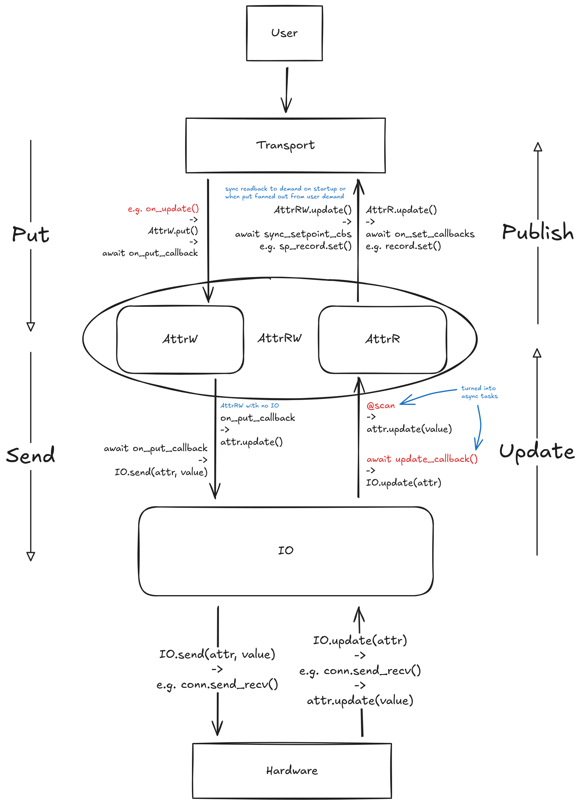

# Transports

This guide explains how transports connect FastCS controllers to external protocols, and how they use attribute callbacks to keep the protocol layer synchronized with attribute values.

## Transport Architecture

A transport connects a `ControllerAPI` to an external protocol. The `ControllerAPI` provides read-only access to:

- Attributes (`AttrR`, `AttrW`, `AttrRW`)
- Command methods (`@command`)
- Scan methods (`@scan`)
- Sub-controller APIs (hierarchical structure)

## Implementing a Transport

Subclass `Transport` and implement `connect()` and `serve()`:

```python
import asyncio
from dataclasses import dataclass, field
from typing import Any

from fastcs.controllers import ControllerAPI
from fastcs.transports.transport import Transport

@dataclass
class MyTransport(Transport):
    """Custom transport implementation."""

    host: str = "localhost"
    port: int = 9000

    def connect(
        self,
        controller_api: ControllerAPI,
        loop: asyncio.AbstractEventLoop,
    ) -> None:
        """Called during FastCS initialization.

        Store the controller_api and set up your protocol server.
        """
        self._controller_api = controller_api
        self._loop = loop
        self._server = MyProtocolServer(controller_api, self.host, self.port)

    async def serve(self) -> None:
        """Called to start serving.

        This runs as an async background task. It can block forever.
        """
        await self._server.start()

    @property
    def context(self) -> dict[str, Any]:
        """Optional: Add variables to the interactive shell."""
        return {"my_server": self._server}
```

## Working with ControllerAPI

The `ControllerAPI` provides access to the controller's attributes and methods. Use `walk_api()` to traverse the entire controller hierarchy and register all attributes and commands. Use pattern matching to handle different attribute types.

```python
for controller_api in root_controller_api.walk_api():
    for name, attribute in controller_api.attributes.items():
        match attribute:
            case AttrRW():
                protocol.create_read(name, attribute)
                protocol.create_write(name, attribute)
            case AttrR():
                protocol.create_read(name, attribute)
            case AttrW():
                protocol.create_write(name, attribute)

    for name, command in controller_api.command_methods.items():
        protocol.create_command(name, command)
```

## Attributes

Transports use attribute callbacks to keep their protocol-specific representations synchronized with attribute values:



The diagram above shows the data flow between users, transports, attributes, and
hardware. The following table gives an overview of the data flow for the transport
layer.

| Callback | Registered with | Triggered By | Direction | Purpose |
|----------|-----------------|--------------|-----------|---------|
| On Update | `add_on_update_callback()` | `attr.update(value)` | Publish ↑ | Update protocol representation when attribute value changes |
| Sync Setpoint | `add_sync_setpoint_callback()` | `attr.put(value, sync_setpoint=True)` | Publish ↑ | Update transport's setpoint display without device communication |
| Update Datatype | `add_update_datatype_callback()` | `datatype` property changes | Publish ↑ | Update protocol metadata when datatype changes |
| Put | `attr.put(value)` | Transport receives user input | Put ↓ | Forward write requests from protocol to attribute |

### On Update Callbacks

Use `add_on_update_callback()` to update the protocol layer when an attribute's value changes.

```python
def create_read(name, attribute):
    protocol_read = Protocol(name)

    async def update_protocol_value(value):
        protocol_read.post(value)

    attribute.add_on_update_callback(update_protocol_value)
```

The callback receives the new value and should update the protocol-specific
representation (e.g., posting to a PV, updating a REST endpoint cache, publishing the
change to a subscriber).

### Update Datatype Callbacks

Use `add_update_datatype_callback()` to update protocol metadata when an attribute's datatype changes. This is useful for protocols that expose datatype metadata (like EPICS record fields).

```python
def create_read(name, attribute):
    ...

    attribute.add_on_update_callback(update_protocol_value)

    def update_protocol_metadata(datatype: DataType):
        protocol_read.set_units(datatype.units)
        protocol_read.set_limits(datatype.min, datatype.max)

    attribute.add_update_datatype_callback(update_protocol_metadata)
```

The callback receives the new `DataType` instance and should update the protocol's metadata representation (e.g., EPICS record fields like `EGU`, `HOPR`, `LOPR`).

### Put

When the transport receives a write request from the protocol, call `await
attribute.put(value)` to forward it to the attribute. This triggers validation and
propagates the value to the device via the IO layer. The transport should also update
its own setpoint display directly rather than relying on the sync setpoint callback
being called.

```python
def create_write(name, attribute):
    protocol_setpoint = Protocol(name)

    async def handle_write(value):
        protocol_setpoint.post(value)
        await attribute.put(value)
```

### Sync Setpoint Callbacks

Use `add_sync_setpoint_callback()` to update the protocol layer's setpoint
representation when the transport receives a write request. This is called when
`AttrW.put` is called with `sync_setpoint=True`.

Each transport is responsible for updating its own setpoint display while actioning the
change and should not rely on its sync setpoint callback being called by the attribute,
nor should it call `AttrW.put` with `sync_setpoint=True`. Setpoints should not be synced
between transports in this case - this is intentional to show which transport the change
came from.

```python
def create_write(name, attribute):
    ...

    async def update_setpoint_display(value):
        protocol_setpoint.post(value)

    attribute.add_sync_setpoint_callback(update_setpoint_display)
```

Sync setpoint callbacks are used in specific cases:

- When an attribute delegates to other attributes that actually communicate with the device
- During the first update of an `AttrRW`, to initialize the setpoint with the first readback value

## Commands

Transports can trigger commands, which connect directly to method calls rather than stateful attributes.

```python
def create_command(name, command):
    protocol_command = Protocol(name)

    async def handle_command():
        await command.fn()
        protocol_command.post()
```

## Usage

Transports are automatically registered when subclassing `Transport`:

```python
from fastcs.transports import Transport

@dataclass
class MyTransport(Transport):
    # Automatically added to Transport.subclasses
    pass
```

This allows the transport to be used in YAML configuration files.
